# Hướng Dẫn Chạy Dự Án E-COMMERCE

## Bước 1: Cài đặt Java 23

Đảm bảo máy bạn đã cài đặt Java 23.
Nếu chưa, hãy tải xuống tại đường dẫn sau và đảm bảo đã cài Environment Variables:

[Download Java 23](https://www.oracle.com/java/technologies/downloads/#jdk23-windows)


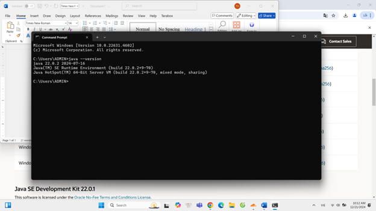
**Java đã được cài đặt thành công**

---

## Bước 2: Cài đặt XAMPP

Đảm bảo máy bạn đã cài đặt XAMPP Control Panel và có thể chạy Apache cùng với MySQL một cách bình thường.


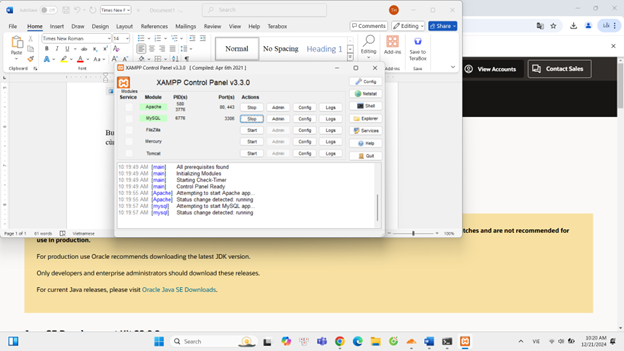
**XAMPP đã được cài đặt thành công và có thể chạy Apache + MySQL**

---

## Bước 3: Giải nén thư mục dự án


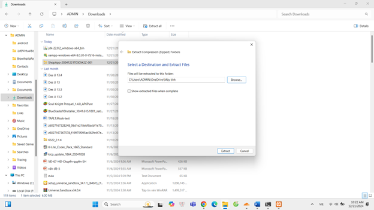

**Giải nén thư mục dự án tới đường dẫn bất kỳ(do bạn tự chỉ định).**

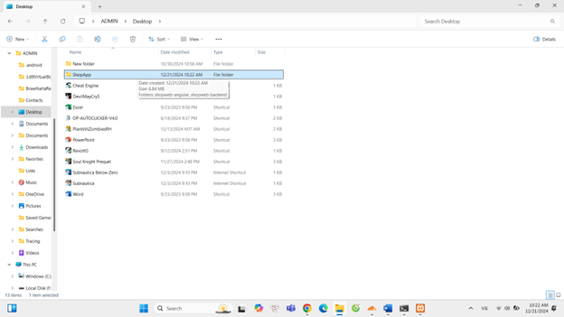
---

## Bước 4: Mở từng thư mục dự án

Tuyệt đối không được mở chung hai folder `shopweb-angular` và `shopweb-backend`, thay vào đó cần mở riêng từng folder.

---

## Bước 5: Cài đặt NodeJS

Tải và cài đặt NodeJS phiên bản **v20.18.1 (LTS)** tại đường dẫn sau:

[Download NodeJS](https://nodejs.org/en/download/prebuilt-installer/current)


**Đảm bảo NodeJS đã được cài đặt thành công**

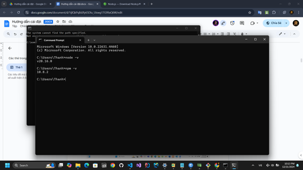

---

## Bước 6: Cài đặt IntelliJ IDEA Ultimate

Tải và cài đặt IntelliJ tại đường dẫn:

[Download IntelliJ Ultimate](https://www.jetbrains.com/idea/download/?section=windows)

> **Lưu ý:** Hãy đảm bảo máy tính của bạn có thể sử dụng **IntelliJ Ultimate 30-day FREE TRIAL**, nếu không, bạn có thể tìm kiếm cách kích hoạt bằng Activation Key.


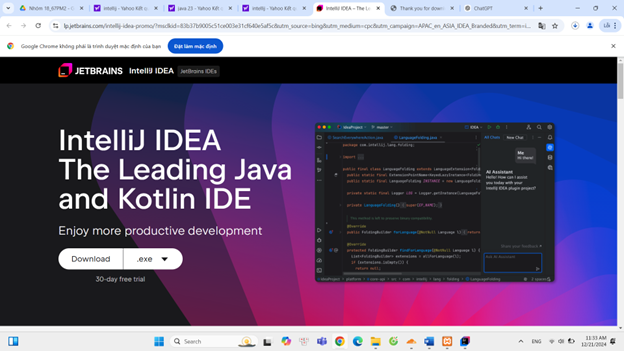

**Chọn toàn bộ option trong quá trình cài đặt**
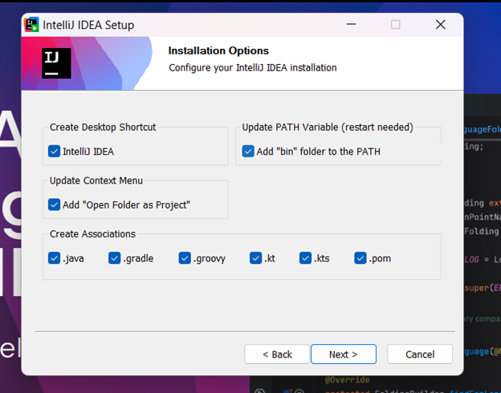

---

## Bước 7: Mở dự án backend bằng IntelliJ

Sau khi cài đặt IntelliJ thành công, Active Trial và mở folder `shopweb-backend` với quyền **Trust Project**.


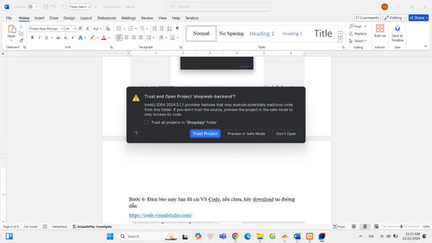

> **Lưu ý:** Khi mở dự án, sẽ có những thông báo yêu cầu như **INSTALL/ ACCEPT/ ALLOW**, hãy chọn toàn bộ để tránh lỗi.

> 
> 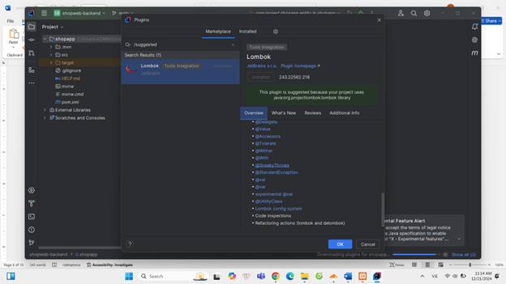
> 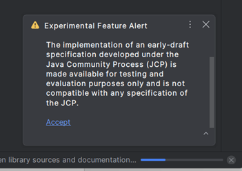
---

## Bước 8: Load dependencies Maven

Chờ **Maven** load toàn bộ dependencies trong file `pom.xml`. Nếu mọi thứ thuận lợi, file này sẽ không có lỗi.

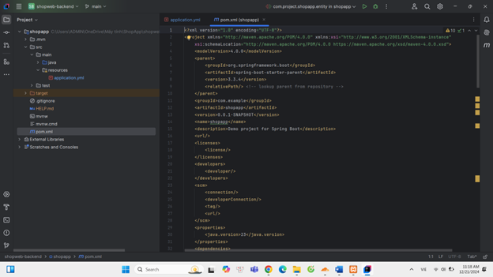

> **Note:** Nếu quá trình build gặp lỗi, hãy thử **Fix automatically** nếu có đề xuất.
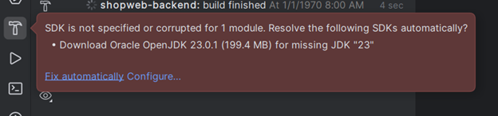
---

## Bước 9: Kiểm tra Project Structure

Mở **Project Structure** và đảm bảo không có phần nào bị lỗi (có nền màu đỏ).

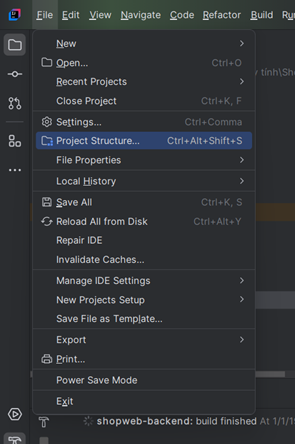
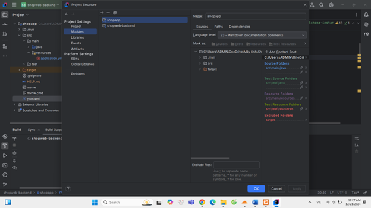

Cấu hình file  **[application.yml](src/main/resources/application.yml)** phù hợp với **XAMPP** và máy tính của bạn (**Ví dụ: username: root, password trống**).
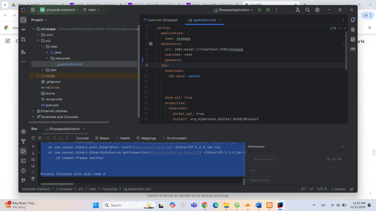
---

## Bước 10: Khởi động Apache & MySQL trong XAMPP

Sau khi Apache và MySQL đã khởi động thành công trong **XAMPP**, truy cập trang Admin của MySQL thông qua đường link: 
`localhost/phpmyadmin`


---

## Bước 11: Tạo database

Tạo cơ sở dữ liệu mới với tên **shopapp**.

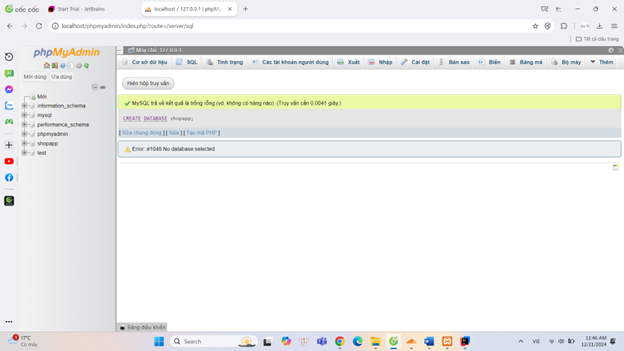

---

## Bước 12: Chạy Backend

Tại IntelliJ, chọn file khởi động là `ShopappApplication` và ấn **Run**.

Nếu mọi thứ thuận lợi, backend sẽ khởi động thành công.

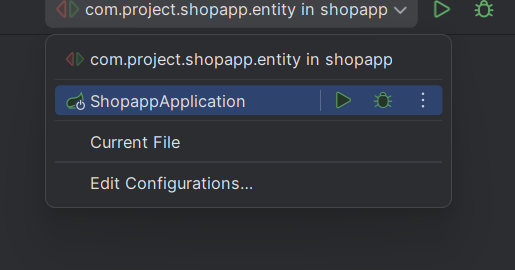
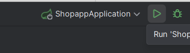

**Backend đã khởi động thành công**
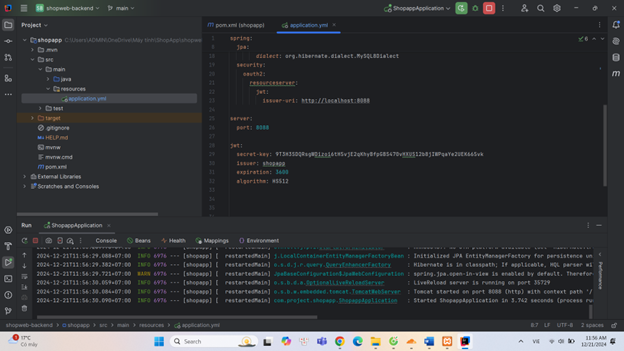


---

## Bước 13: Cài đặt VS Code

Nếu chưa có, tải và cài đặt **VS Code** tại:

[Download VS Code](https://code.visualstudio.com/)

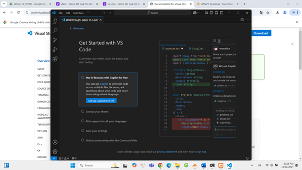

---

## Bước 14: Cài đặt Git

Nếu chưa có, tải và cài đặt **Git** tại:

[Download Git](https://git-scm.com/downloads)

**Git đã được cài đặt thành công**

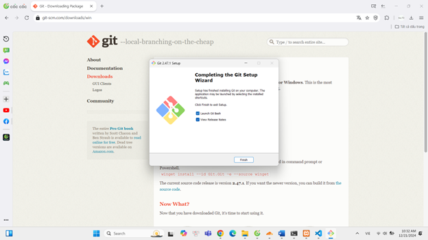
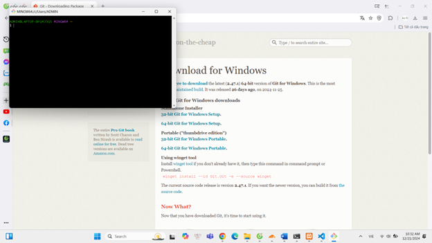

---

## Bước 15: Mở frontend bằng VS Code

Mở folder `shopweb-angular` trong **VS Code**.

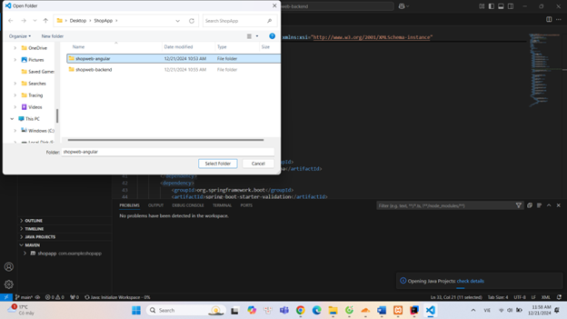

> **Lưu ý:** VS Code có thể yêu cầu cài đặt các tiện ích hỗ trợ, nên cài đặt để tránh lỗi phát sinh.
>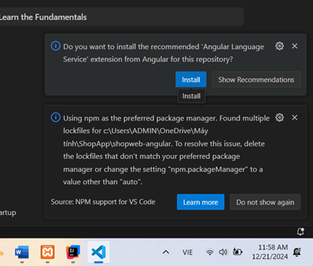
> 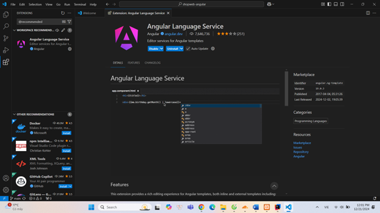
---

## Bước 16: Kiểm tra và cài đặt NodeJS & npm

Mở **New Terminal** và chạy các lệnh sau:

```sh
node -v
npm -v
```

Đảm bảo NodeJS và npm đã được cài đặt.

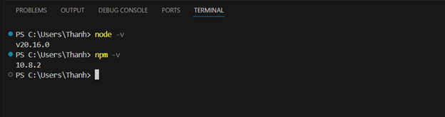

Chạy lệnh `npm install`, nếu gặp lỗi, thử:

```sh
npm uninstall @angular/core @angular/animations
```
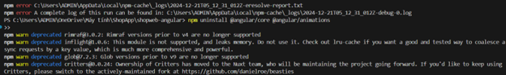

Nếu có lỗi **“…serverity vulnerabilities”**, chạy:

```sh
npm audit fix
```
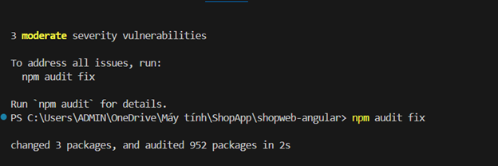

Sau đó chạy:

```sh
npm install -g @angular/cli
npm install
```

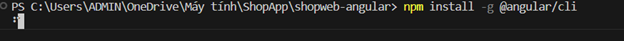
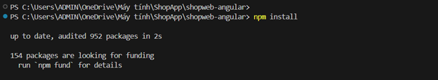

Khi mọi thứ đã ổn định, chạy frontend bằng lệnh:

```sh
ng serve
```

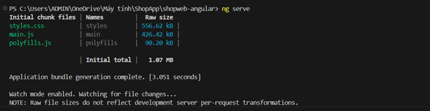

---

## Bước 17: Thêm tài khoản admin vào database

Chạy lệnh sau trong MySQL:

```sql
INSERT INTO `user` (email, password, role)
VALUES ('thanh@gmail.com', '$2a$10$2OfayphyB7rziOnJ6HCEius4s3bG8IMAI/kSldF5akQS8TeFlV2Oy', 'admin');
```

Tài khoản admin mới:

- **Email**: `thanh@gmail.com`
- **Password**: `jukistricker`

---

## Bước 18: Chạy frontend

Sau khi frontend khởi động, truy cập trang web theo đường dẫn hiển thị trong terminal (thường là **localhost:4200**).

> **Lưu ý:** Nếu trang web hiển thị màn hình **Login** thay vì trang chủ, hãy đăng nhập bằng tài khoản admin vừa thêm để fix lỗi.


Sau lần truy cập đầu tiên, lỗi này sẽ không xảy ra nữa.

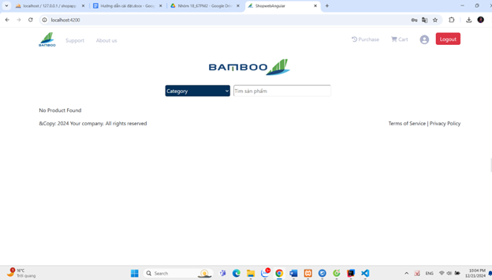

---

Chúc bạn cài đặt thành công! 🎉
